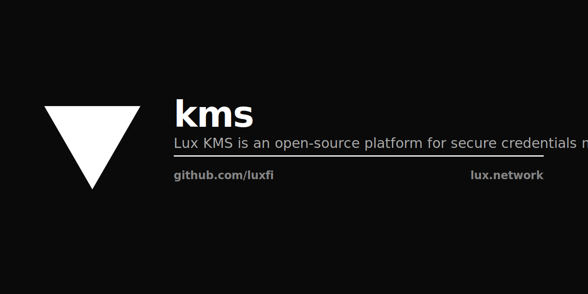

<p align="center"></p>

# KMS

MPC-backed key management service for the Lux Network. Manages validator keys, threshold signing, and key rotation using distributed MPC (Multi-Party Computation).

**No legacy fork. No PostgreSQL.** Pure Go server backed by [MPC](https://github.com/luxfi/mpc) for threshold cryptography and a JSON file store for metadata.

## Architecture

```
┌─────────────┐      ┌─────────────┐      ┌─────────────┐
│   Client     │─────▶│   KMS   │─────▶│   MPC   │
│ (ATS / BD)   │ HTTP │  Go Server  │ HTTP │  CGGMP21 /  │
│              │      │  :8080      │      │  FROST      │
└─────────────┘      └──────┬──────┘      └─────────────┘
                            │
                     ┌──────▼──────┐
                     │  JSON Store │
                     │  keys.json  │
                     └─────────────┘
```

### How it works

1. **KMS** is the HTTP API layer — manages validator key lifecycle
2. **MPC** is the crypto backend — performs distributed key generation (DKG) and threshold signing
3. **Store** is a JSON file — maps validator IDs to MPC wallet IDs (no database needed)

### Key types

| Key | Protocol | Curve | Use |
|-----|----------|-------|-----|
| BLS | CGGMP21 | secp256k1 | Consensus signing (BLS aggregation) |
| Corona | FROST | ed25519 | Ring signatures, post-quantum prep |

## Integration with Hanzo Base

KMS runs as a standalone service alongside [Hanzo Base](https://github.com/hanzoai/base) services (ATS, BD, TA). In production:

```
                    ┌──────────────────────┐
                    │     hanzoai/gateway   │
                    └──────────┬───────────┘
                               │
          ┌────────────────────┼────────────────────┐
          │                    │                    │
    ┌─────▼─────┐       ┌─────▼─────┐       ┌─────▼─────┐
    │    ATS     │       │    BD     │       │    TA     │
    │  (Base)    │       │  (Base)   │       │  (Base)   │
    │  :8090     │       │  :8091    │       │  :8092    │
    └─────┬─────┘       └─────┬─────┘       └─────┬─────┘
          │                    │                    │
          └────────────────────┼────────────────────┘
                               │
                         ┌─────▼─────┐       ┌───────────┐
                         │  KMS  │──────▶│  MPC  │
                         │  :8080    │       │  :8081    │
                         └───────────┘       └───────────┘
```

Base services call KMS for:
- **Transit encrypt/decrypt** — field-level encryption with per-customer DEKs
- **Validator key management** — generate, sign, rotate validator keys
- **MPC signing** — threshold signing for cross-chain bridge operations

### IAM Integration

KMS authenticates callers via [Hanzo IAM](https://github.com/hanzoai/iam) JWT tokens. The `Authorization: Bearer <token>` header is validated against the IAM JWKS endpoint. No API keys, no separate auth system.

## API

```
POST   /api/v1/keys/generate      Generate validator key set (BLS + Corona via MPC DKG)
GET    /api/v1/keys                List all validator key sets
GET    /api/v1/keys/{id}           Get validator key set by ID
POST   /api/v1/keys/{id}/sign     Sign message with BLS or Corona key
POST   /api/v1/keys/{id}/rotate   Rotate (reshare) keys with new threshold/participants
GET    /api/v1/status              KMS + MPC cluster status
GET    /healthz                    Health check
```

### Generate keys

```bash
curl -X POST http://kms:8080/api/v1/keys/generate \
  -H 'Content-Type: application/json' \
  -d '{"validator_id": "node-0", "threshold": 3, "parties": 5}'
```

### Sign with BLS

```bash
curl -X POST http://kms:8080/api/v1/keys/node-0/sign \
  -H 'Content-Type: application/json' \
  -d '{"key_type": "bls", "message": "base64-encoded-message"}'
```

## Configuration

| Env Var | Flag | Default | Description |
|---------|------|---------|-------------|
| `KMS_LISTEN` | `--listen` | `:8080` | HTTP listen address |
| `MPC_URL` | `--mpc-url` | `http://mpc-api.lux-mpc.svc.cluster.local:8081` | MPC daemon URL |
| `MPC_TOKEN` | `--mpc-token` | - | MPC API auth token |
| `MPC_VAULT_ID` | `--vault-id` | - | MPC vault ID (required) |
| `KMS_STORE_PATH` | `--store` | `/data/kms/keys.json` | Key metadata store path |

## Running

```bash
# Build
go build -o kms ./cmd/kms

# Run (requires MPC daemon running)
./kms --vault-id=<your-vault-id> --mpc-url=http://localhost:8081
```

## Kubernetes

KMS deploys as a Deployment (not StatefulSet — metadata is on a PVC or ConfigMap):

```yaml
apiVersion: apps/v1
kind: Deployment
metadata:
  name: kms
spec:
  replicas: 2
  template:
    spec:
      containers:
      - name: kms
        image: us-docker.pkg.dev/<project>/backend/kms:main
        ports:
        - containerPort: 8080
        env:
        - name: MPC_VAULT_ID
          valueFrom:
            secretKeyRef:
              name: kms-secrets
              key: MPC_VAULT_ID
```

## K8s Operator

The `k8-operator/` directory contains a Kubernetes operator that syncs KMS-managed secrets into K8s Secret resources. CRDs:

- `KmsSecret` — pull secrets from KMS into K8s Secrets
- `KmsDynamicSecret` — ephemeral secrets with TTL
- `KmsPushSecret` — push K8s Secrets to KMS

## Related

- [luxfi/mpc](https://github.com/luxfi/mpc) — MPC daemon (CGGMP21 + FROST)
- [luxfi/hsm](https://github.com/luxfi/hsm) — Hardware Security Module abstraction
- [hanzoai/base](https://github.com/hanzoai/base) — Go application framework (ATS, BD, TA use this)
- [hanzoai/iam](https://github.com/hanzoai/iam) — Identity and Access Management

## License

MIT — see [LICENSE](LICENSE)
