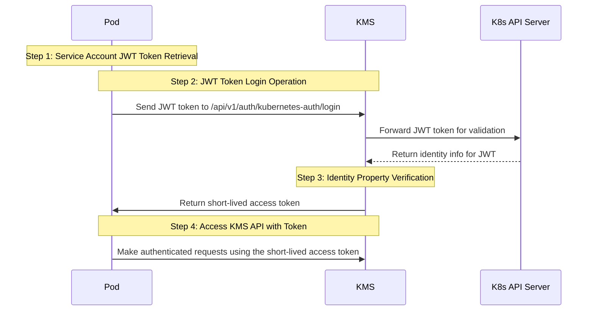

**Kubernetes Auth** is a Kubernetes-native authentication method for applications (e.g. pods) to access KMS.

## Diagram

    The following sequence diagram illustrates the Kubernetes Auth workflow for authenticating applications running in pods with KMS.



## Concept

At a high-level, KMS authenticates an application in Kubernetes by verifying its identity and checking that it meets specific requirements (e.g. it is bound to an allowed service account) at the `/api/v1/auth/kubernetes-auth/login` endpoint. If successful,
then KMS returns a short-lived access token that can be used to make authenticated requests to the KMS API.

To be more specific:

1. The application deployed on Kubernetes retrieves its [service account credential](https://kubernetes.io/docs/tasks/configure-pod-container/configure-service-account/#opt-out-of-api-credential-automounting) that is a JWT token at the `/var/run/secrets/kubernetes.io/serviceaccount/token` pod path.
2. The application sends the JWT token to KMS at the `/api/v1/auth/kubernetes-auth/login` endpoint after which KMS forwards the JWT token to the Kubernetes API Server at the TokenReview API for verification and to obtain the service account information associated with the JWT token.
KMS is able to authenticate and interact with the TokenReview API by using either the long lived JWT token set while configuring this authentication method or by using the incoming token itself. The JWT token mentioned in this context is referred as the token reviewer JWT token.
3. KMS checks the service account properties against set criteria such **Allowed Service Account Names** and **Allowed Namespaces**.
4. If all is well, KMS returns a short-lived access token that the application can use to make authenticated requests to the KMS API.

<Note>
  We recommend using one of KMS's clients like SDKs or the KMS Agent
  to authenticate with KMS using Kubernetes Auth as they handle the
  authentication process including service account credential retrieval for you.
</Note>

## Guide

In the following steps, we explore how to create and use identities for your applications in Kubernetes to access the KMS API using the Kubernetes Auth authentication method.


<Steps>
    <Step title="Obtaining the token reviewer JWT for KMS">
      <Accordion title="Option 1: Reviewer JWT Token">

        <Note>
        **When to use this option**: Choose this approach when you want centralized authentication management. Only one service account needs special permissions, and your application service accounts remain unchanged.
        </Note>
        1.1. Start by creating a service account in your Kubernetes cluster that will be used by KMS to authenticate with the Kubernetes API Server.

        ```yaml kms-service-account.yaml
        apiVersion: v1
        kind: ServiceAccount
        metadata:
          name: kms-auth
          namespace: default
        ```

        ```
        kubectl apply -f kms-service-account.yaml
        ```

        1.2. Bind the service account to the `system:auth-delegator` cluster role. As described [here](https://kubernetes.io/docs/reference/access-authn-authz/rbac/#other-component-roles), this role allows delegated authentication and authorization checks, specifically for KMS to access the [TokenReview API](https://kubernetes.io/docs/reference/kubernetes-api/authentication-resources/token-review-v1/). You can apply the following configuration file:

        ```yaml cluster-role-binding.yaml
        apiVersion: rbac.authorization.k8s.io/v1
        kind: ClusterRoleBinding
        metadata:
          name: role-tokenreview-binding
          namespace: default
        roleRef:
          apiGroup: rbac.authorization.k8s.io
          kind: ClusterRole
          name: system:auth-delegator
        subjects:
          - kind: ServiceAccount
            name: kms-auth
            namespace: default
        ```

        ```
        kubectl apply -f cluster-role-binding.yaml
        ```

        1.3. Next, create a long-lived service account JWT token (i.e. the token reviewer JWT token) for the service account using this configuration file for a new `Secret` resource:

        ```yaml service-account-token.yaml
        apiVersion: v1
        kind: Secret
        type: kubernetes.io/service-account-token
        metadata:
          name: kms-auth-token
          annotations:
            kubernetes.io/service-account.name: "kms-auth"
        ```


        ```
        kubectl apply -f service-account-token.yaml
        ```

        1.4. Link the secret in step 1.3 to the service account in step 1.1:

        ```bash
        kubectl patch serviceaccount kms-auth -p '{"secrets": [{"name": "kms-auth-token"}]}' -n default
        ```

        1.5. Finally, retrieve the token reviewer JWT token from the secret.

        ```bash
        kubectl get secret kms-auth-token -n default -o=jsonpath='{.data.token}' | base64 --decode
        ```

        Keep this JWT token handy as you will need it for the **Token Reviewer JWT** field when configuring the Kubernetes Auth authentication method for the identity in step 2.
      </Accordion>

      <Accordion title="Option 2: Client JWT as Reviewer JWT Token">
        <Note>
        **When to use this option**: Choose this approach to eliminate long-lived tokens. This option simplifies KMS configuration but requires each application service account to have elevated permissions.
        </Note>

        The self-validation method eliminates the need for a separate long-lived reviewer JWT by using the same token for both authentication and validation. Instead of creating a dedicated reviewer service account, you'll grant the necessary permissions to each application service account.

        For each service account that needs to authenticate with KMS, add the `system:auth-delegator` role:

        ```yaml client-role-binding.yaml
        apiVersion: rbac.authorization.k8s.io/v1
        kind: ClusterRoleBinding
        metadata:
          name: kms-client-binding-[your-app-name]
        roleRef:
          apiGroup: rbac.authorization.k8s.io
          kind: ClusterRole
          name: system:auth-delegator
        subjects:
          - kind: ServiceAccount
            name: [your-app-service-account]
            namespace: [your-app-namespace]
        ```

        ```
        kubectl apply -f client-role-binding.yaml
        ```

        When configuring Kubernetes Auth in KMS, leave the **Token Reviewer JWT** field empty. KMS will use the client's own token for validation.
      </Accordion>
      <Accordion title="Option 3: Use Gateway as Reviewer">
        <Note>
        **When to use this option**: Choose this approach when you have a gateway deployed in your Kubernetes Cluster and wish to eliminate long-lived tokens. This approach simplifies KMS Kubernetes Auth configuration, and only one service account will need to have the elevated `system:auth-delegator` ClusterRole binding.
        </Note>

        <Info>
          **Note:** Gateway is a paid feature. - **KMS Cloud users:** Gateway is
          available under the **Enterprise Tier**. - **Self-Hosted KMS:** Please
          contact [sales@lux.network](mailto:sales@lux.network) to purchase an
          enterprise license.
        </Info>

        <Steps>
          <Step title="Deploying a gateway">
            To deploy a gateway in your Kubernetes cluster, follow our [Gateway deployment guide using helm](/documentation/platform/gateways/overview).
          </Step>

          <Step title="Grant the gateway the system:auth-delegator ClusterRole binding">
            To grant the gateway the `system:auth-delegator` ClusterRole binding, you can use the following command:

            ```yaml gateway-role-binding.yaml
            apiVersion: rbac.authorization.k8s.io/v1
            kind: ClusterRoleBinding
            metadata:
              name: kms-token-reviewer-role-binding
              namespace: default # Replace with your namespace if not default
            roleRef:
              apiGroup: rbac.authorization.k8s.io
              kind: ClusterRole
              name: system:auth-delegator
            subjects:
              - kind: ServiceAccount
                name: kms-gateway # The name of the gateway service account
                namespace: default # Replace with your namespace if not default
            ```

            ```bash
            kubectl apply -f gateway-role-binding.yaml
            ```

            <Tip>
              The gateway service account name is `kms-gateway` by default if deployed using Helm.
            </Tip>
          </Step>

          <Step title="Configure the Kubernetes Auth authentication method for the identity">
            To configure your Kubernetes Auth method to use the gateway as the token reviewer, set the `Review Method` to "Gateway as Reviewer", and select the gateway you want to use as the token reviewer.

            
          </Step>
        </Steps>
      </Accordion>
    </Step>

  <Step title="Creating an identity">
    To create an identity, head to your Organization Settings > Access Control > Identities and press **Create identity**.

    

    When creating an identity, you specify an organization level [role](/documentation/platform/role-based-access-controls) for it to assume; you can configure roles in Organization Settings > Access Control > Organization Roles.

    

    Now input a few details for your new identity. Here's some guidance for each field:

    - Name (required): A friendly name for the identity.
    - Role (required): A role from the **Organization Roles** tab for the identity to assume. The organization role assigned will determine what organization level resources this identity can have access to.

    Once you've created an identity, you'll be redirected to a page where you can manage the identity.

    

    Since the identity has been configured with Universal Auth by default, you should re-configure it to use Kubernetes Auth instead. To do this, press to edit the **Authentication** section,
    remove the existing Universal Auth configuration, and add a new Kubernetes Auth configuration onto the identity.

    

    

    Here's some more guidance on each field:

    - Kubernetes Host / Base Kubernetes API URL: The host string, host:port pair, or URL to the base of the Kubernetes API server. This can usually be obtained by running `kubectl cluster-info`.
    - Token Reviewer JWT: A long-lived service account JWT token for KMS to access the [TokenReview API](https://kubernetes.io/docs/reference/kubernetes-api/authentication-resources/token-review-v1/) to validate other service account JWT tokens submitted by applications/pods. This is the JWT token obtained from step 1.5(Reviewer Tab). If omitted, the client's own JWT will be used instead, which requires the client to have the `system:auth-delegator` ClusterRole binding.
      This is shown in step 1, option 2.
    - Allowed Service Account Names: A comma-separated list of trusted service account names that are allowed to authenticate with KMS.
    - Allowed Namespaces: A comma-separated list of trusted namespaces that service accounts must belong to authenticate with KMS.
    - Allowed Audience: An optional audience claim that the service account JWT token must have to authenticate with KMS.
    - CA Certificate: The PEM-encoded CA cert for the Kubernetes API server. This is used by the TLS client for secure communication with the Kubernetes API server.
    - Access Token TTL (default is `2592000` equivalent to 30 days): The lifetime for an acccess token in seconds. This value will be referenced at renewal time.
    - Access Token Max TTL (default is `2592000`  equivalent to 30 days): The maximum lifetime for an acccess token in seconds. This value will be referenced at renewal time.
    - Access Token Max Number of Uses (default is `0`): The maximum number of times that an access token can be used; a value of `0` implies infinite number of uses.
    - Access Token Trusted IPs: The IPs or CIDR ranges that access tokens can be used from. By default, each token is given the `0.0.0.0/0`, allowing usage from any network address.

  </Step>
  <Step title="Adding an identity to a project">
    To enable the identity to access project-level resources such as secrets within a specific project, you should add it to that project.

    To do this, head over to the project you want to add the identity to and go to Project Settings > Access Control > Machine Identities and press **Add identity**.

    Next, select the identity you want to add to the project and the project level role you want to allow it to assume. The project role assigned will determine what project level resources this identity can have access to.

    

    

  </Step>
  <Step title="Accessing the KMS API with the identity">
    To access the KMS API as the identity, you should first make sure that the pod running your application is bound to a service account specified in the **Allowed Service Account Names** field of the identity's Kubernetes Auth authentication method configuration in step 2.

    Once bound, the pod will receive automatically mounted service account credentials that is a JWT token at the `/var/run/secrets/kubernetes.io/serviceaccount/token` path. This token should be used to authenticate with KMS at the `/api/v1/auth/kubernetes-auth/login` endpoint.

    For information on how to configure sevice accounts for pods, refer to the guide [here](https://kubernetes.io/docs/tasks/configure-pod-container/configure-service-account/).

    We provide a code example below of how you might retrieve the JWT token and use it to authenticate with KMS to gain access to the [KMS API](/api-reference/overview/introduction).

   <Accordion
        title="Sample code for inside an application"
    >
        The shown example uses Node.js but you can use any other language to retrieve the service account JWT token and use it to authenticate with KMS.

        ```javascript
        const fs = require("fs");
        try {
            const tokenPath = "/var/run/secrets/kubernetes.io/serviceaccount/token";
            const jwtToken = fs.readFileSync(tokenPath, "utf8");

            const kmsUrl = "https://kms.lux.network"; // or your self-hosted KMS URL
            const identityId = "<your-identity-id>";

            const { data } = await axios.post(
                `{kmsUrl}/api/v1/auth/kubernetes-auth/login`,
                {
                    identityId,
                    jwt,
                }
            );

            console.log("result data: ", data); // access token here
        } catch(err) {
            console.error(err);
        }
        ```
    </Accordion>

    <Tip>
        We recommend using one of KMS's clients like SDKs or the KMS Agent to authenticate with KMS using Kubernetes Auth as they handle the authentication process including service account credential retrieval for you.
    </Tip>

    <Note>
    Each identity access token has a time-to-live (TTL) which you can infer from the response of the login operation;
    the default TTL is `7200` seconds which can be adjusted.

    If an identity access token exceeds its max ttl, it can no longer authenticate with the KMS API. In this case,
    a new access token should be obtained by performing another login operation.
    </Note>

  </Step>
</Steps>

**FAQ**

<AccordionGroup>
<Accordion title="Why is the KMS API rejecting my service account JWT token?">
  There are a few reasons for why this might happen:
  - The Kubernetes Auth authentication method configuration is invalid.
  - The service account JWT token has expired is malformed or invalid.
  - The service account associated with the JWT token does not meet the criteria set forth in the Kubernetes Auth authentication method configuration such as **Allowed Service Account Names** and **Allowed Namespaces**.
</Accordion>
<Accordion title="Why is the KMS API rejecting my access token?">
  There are a few reasons for why this might happen:

- The access token has expired.
- The identity is insufficiently permissioned to interact with the resources you wish to access.
- The client access token is being used from an untrusted IP.

</Accordion>
<Accordion title="What is access token renewal and TTL/Max TTL?">
A identity access token can have a time-to-live (TTL) or incremental lifetime after which it expires.

In certain cases, you may want to extend the lifespan of an access token; to do so, you must set a max TTL parameter.

A token can be renewed any number of times where each call to renew it can extend the token's lifetime by increments of the access token's TTL.
Regardless of how frequently an access token is renewed, its lifespan remains bound to the maximum TTL determined at its creation.

</Accordion>
</AccordionGroup>
