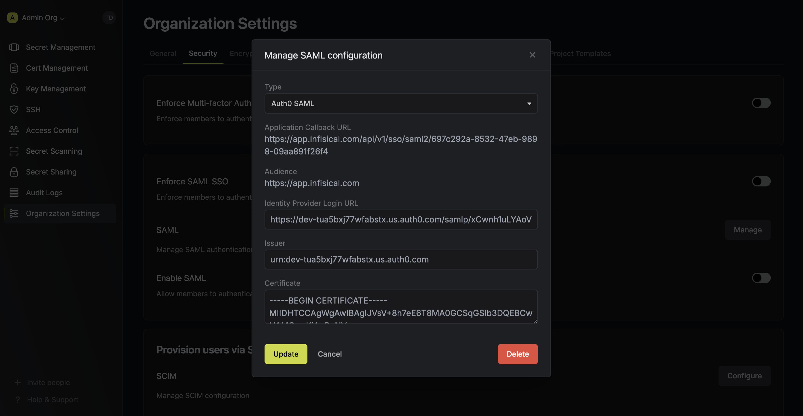

<Info>
  Auth0 SAML SSO feature is a paid feature. If you're using KMS Cloud,
  then it is available under the **Pro Tier**. If you're self-hosting KMS,
  then you should contact sales@lux.network to purchase an enterprise license
  to use it.
</Info>

<Steps>
   <Step title="Prepare the SAML SSO configuration in KMS">
       In KMS, head to the **Single Sign-On (SSO)** page and select the **General** tab. Click **Connect** for **SAML** under the Connect to an Identity Provider section. Select **Auth0**, then click **Connect** again.

       

        Next, note the **Application Callback URL** and **Audience** to use when configuring the Auth0 SAML application.

        

   </Step>
   <Step title="Create a SAML application in Auth0">
        2.1. In your Auth0 account, head to Applications and create an application.

        

        Select **Regular Web Application** and press **Create**.

        

        2.2. In the Application head to Settings > Application URIs and add the **Application Callback URL** from step 1 into the **Allowed Callback URLs** field.

        

        2.3. In the Application head to Addons > SAML2 Web App and copy the **Issuer**, **Identity Provider Login URL**, and **Identity Provider Certificate** from the **Usage** tab.

        

        2.4. Back in KMS, set **Issuer**, **Identity Provider Login URL**, and **Certificate** to the corresponding items from step 2.3.

        

        2.5. Back in Auth0, in the **Settings** tab, set the **Application Callback URL** to the **Application Callback URL** from step 1
        and update the **Settings** field with the JSON under the picture below (replacing `<audience-from-kms>` with the **Audience** from step 1).

        

        ```json
        {
        "audience": "<audience-from-kms>",
        "mappings": {
            "email": "http://schemas.xmlsoap.org/ws/2005/05/identity/claims/email",
            "given_name": "http://schemas.xmlsoap.org/ws/2005/05/identity/claims/firstName",
            "family_name": "http://schemas.xmlsoap.org/ws/2005/05/identity/claims/lastName"
        },
        "signatureAlgorithm": "rsa-sha256",
        "digestAlgorithm": "sha256",
        "signResponse": true
        }
        ```

        Click **Save**.

    <Warning>
        Make sure the `firstName` claim is mapped to a valid field of your Auth0 users. If your users don't have a `"given_name"` field available, you can replace it with `"name"` or another field that exists in your user profile on the left side of the mapping.
    </Warning>
    </Step>
    <Step title="Enable SAML SSO in KMS">
        Enabling SAML SSO allows members in your organization to log into KMS via Auth0.

        
    </Step>
    <Step title="Enforce SAML SSO in KMS">
        Enforcing SAML SSO ensures that members in your organization can only access KMS
        by logging into the organization via Auth0.

        To enforce SAML SSO, you're required to test out the SAML connection by successfully authenticating at least one Auth0 user with KMS;
        Once you've completed this requirement, you can toggle the **Enforce SAML SSO** button to enforce SAML SSO.

        <Info>
            In case of a lockout, an organization admin can use the [Admin Login Portal](https://lux.network/docs/documentation/platform/sso/overview#admin-login-portal) in the `/login/admin` path e.g. https://kms.lux.network/login/admin.
        </Info>
    </Step>

</Steps>

<Tip>
    If you are only using one organization on your KMS instance, you can configure a default organization in the [Server Admin Console](../admin-panel/server-admin#default-organization) to expedite SAML login.
</Tip>

<Note>
    If you're configuring SAML SSO on a self-hosted instance of KMS, make
    sure to set the `AUTH_SECRET` and `SITE_URL` environment variable for it to
    work:
    <div class="height:1px;"/>
    - `AUTH_SECRET`: A secret key used for signing and verifying JWT. This
    can be a random 32-byte base64 string generated with `openssl rand -base64
    32`.
    <div class="height:1px;"/>
    - `SITE_URL`: The absolute URL of your self-hosted instance of KMS including the protocol (e.g. https://kms.lux.network)
</Note>
