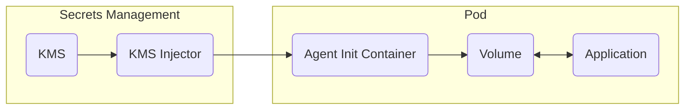

## Overview

The KMS Kubernetes Agent Injector allows you to inject secrets directly into your Kubernetes pods. The Injector will create a [KMS Agent](/integrations/platforms/kms-agent) container within your pod that syncs secrets from KMS into a shared volume mount within your pod.


The KMS Agent Injector will patch and modify your pod's deployment to contain an [KMS Agent](/integrations/platforms/kms-agent) container which renders your KMS secrets into a shared volume mount within your pod.

The KMS Agent Injector is built on [Kubernetes Mutating Admission Webhooks](https://kubernetes.io/docs/reference/access-authn-authz/admission-controllers), and will watch for `CREATE` and `UPDATE` events on pods in your cluster.
The injector is namespace-agnostic, and will watch for pods in any namespace, but will only patch pods that have the `org.lux.network/inject` annotation set to `true`.




## Install the KMS Agent Injector

To install the KMS Agent Injector, you will need to install our helm charts using [Helm](https://helm.sh/).

```bash
helm repo add kms-helm-charts 'https://dl.cloudsmith.io/public/kms/helm-charts/helm/charts/'
helm repo update
helm install --generate-name kms-helm-charts/kms-agent-injector
```

After installing the helm chart you can verify that the injector is running and working as intended by checking the logs of the injector pod.
```bash
$ kubectl logs deployment/kms-agent-injector 
2025/05/19 14:20:05 Starting kms-agent-injector...
2025/05/19 14:20:05 Generating self-signed certificate...
2025/05/19 14:20:06 Creating directory: /tmp/tls
2025/05/19 14:20:06 Writing cert to: /tmp/tls/tls.crt
2025/05/19 14:20:06 Writing key to: /tmp/tls/tls.key
2025/05/19 14:20:06 Starting HTTPS server on port 8585...
2025/05/19 14:20:06 Attempting to update webhook config (attempt 1)...
2025/05/19 14:20:06 Successfully updated webhook configuration with CA bundle
```

## Supported annotations

The KMS Agent Injector supports the following annotations:

<Accordion title="org.lux.network/inject">
  The inject annotation is used to enable the injector on a pod. Set the value to `true` and the pod will be patched with an KMS Agent container on update or create.
</Accordion>
<Accordion title="org.lux.network/inject-mode">
  The inject mode annotation is used to specify the mode to use to inject the secrets into the pod. Currently only `init` mode is supported.

  - `init`: The init method will create an init container for the pod that will render the secrets into a shared volume mount within the pod. The agent init container will run before any other containers in the pod runs, including other init containers.
</Accordion>
<Accordion title="org.lux.network/agent-config-map">
  The agent config map annotation is used to specify the name of the config map that contains the configuration for the injector. The config map must be in the same namespace as the pod.
</Accordion>

## ConfigMap Configuration

### Supported Fields

When you are configuring a pod to use the injector, you must create a config map in the same namespace as the pod you want to inject secrets into.
The entire config needs to be of string format and needs to be assigned to the `config.yaml` key in the config map. You can find a full example of the config at the end of this section.

<Accordion title="kms.address">
  The address of your KMS instance. This field is optional and will default to `https://kms.lux.network` if not provided.
</Accordion>

<Accordion title="kms.auth.type">
  The authentication type to use to connect to KMS. Currently only the `kubernetes` authentication type is supported.
  You can refer to our [Kubernetes Auth](/documentation/platform/identities/kubernetes-auth) documentation for more information on how to create a machine identity for Kubernetes Auth.
  Please note that the pod's default service account will be used to authenticate with KMS.
</Accordion>

<Accordion title="kms.auth.config.identity-id">
  The ID of the machine identity to use to connect to KMS. This field is required if the `kms.auth.type` is set to `kubernetes`.
</Accordion>

<Accordion title="templates[]">
The templates hold an array of templates that will be rendered and injected into the pod.
</Accordion>

<Accordion title="templates[].destination-path">
  The path to inject the secrets into within the pod.
  If not specified, this will default to `/shared/kms-secrets`. If you have multiple templates and don't provide a destination path, the destination paths will default to `/shared/kms-secrets-1`, `/shared/kms-secrets-2`, etc.
</Accordion>

<Accordion title="templates[].template-content">
  The content of the template to render.
  This will be rendered as a [Go Template](https://pkg.go.dev/text/template) and will have access to the following variables.
  It follows the templating format and supports the same functions as the [KMS Agent](/integrations/platforms/kms-agent#quick-start-kms-agent)
</Accordion>


### Authentication
The KMS Agent Injector only supports Machine Identity [Kubernetes Auth](/documentation/platform/identities/kubernetes-auth) authentication at the moment.

To configure Kubernetes Auth, you need to set the `auth.type` field to `kubernetes` and set the `auth.config.identity-id` to the ID of the machine identity you wish to use for authentication.

```yaml
auth:
  type: "kubernetes"
  config:
    identity-id: "<your-kms-machine-identity-id>"
```

### Example ConfigMap
```yaml config-map.yaml
apiVersion: v1
kind: ConfigMap
metadata:
  name: demo-config-map
data:
  config.yaml: |
    kms:
      address: "https://kms.lux.network"
      auth:
        type: "kubernetes"
        config:
          identity-id: "<your-kms-machine-identity-id>"
    templates:
      - destination-path: "/path/to/save/secrets/file.txt"
        template-content: |
          {{- with secret "<your-project-id>" "dev" "/" }}
          {{- range . }}
          {{ .Key }}={{ .Value }}
          {{- end }}
          {{- end }}
```

```bash
kubectl apply -f config-map.yaml
```

To use the config map in your pod, you will need to add the `org.lux.network/agent-config-map` annotation to your pod's deployment. The value of the annotation is the name of the config map you created above.
```yaml
apiVersion: v1
kind: Pod
metadata:
  name: demo
  labels:
    app: demo
  annotations:
    org.lux.network/inject: "true" # Set to true for the injector to patch the pod on create/update events
    org.lux.network/inject-mode: "init" # The mode to use to inject the secrets into the pod. Currently only `init` mode is supported.
    org.lux.network/agent-config-map: "name-of-config-map" # The name of the config map that you created above, which contains all the settings for injecting the secrets into the pod
spec:
  # ...
```


## Quick Start
In this section we'll walk through a full example of how to inject secrets into a pod using the KMS Agent Injector.
In this example we'll create a basic nginx deployment and print a KMS secret called `API_KEY` to the container logs.

### Create secrets in KMS
First you'll need to create the secret in KMS.

- `API_KEY`: The API key to use for the nginx deployment.

Once you've created the secret, save your project ID, environment slug, and secret path, as these will be used in the next step.

### Configuration
To use the injector you must create a config map in the same namespace as the pod you want to inject secrets into. In this example we'll create a config map in the `test-namespace` namespace.

The agent injector will authenticate with KMS using a [Kubernetes Auth](/documentation/platform/identities/kubernetes-auth) machine identity. Please follow the [instructions](/documentation/platform/identities/kubernetes-auth) to create a machine identity configured for Kubernetes Auth.
The agent injector will use the service account token of the pod to authenticate with KMS.

The `template-content` will be rendered as a [Go Template](https://pkg.go.dev/text/template) and will have access to the following variables. It follows the templating format and supports the same functions as the [KMS Agent](/integrations/platforms/kms-agent#quick-start-kms-agent)
The `destination-path` refers to the path within the pod that the secrets will be injected into. In this case we're injecting the secrets into a file called `/kms/secrets`.


Replace the `<your-project-id>`, `<your-environment-slug>`, with your project ID and the environment slug of where you created your secrets in KMS. Replace `<your-kms-machine-identity-id>` with the ID of your machine identity configured for Kubernetes Auth.
```yaml config-map.yaml
apiVersion: v1
kind: ConfigMap
metadata:
  name: nginx-kms-config-map
  namespace: test-namespace
data:
  config.yaml: |
    kms:
      address: "https://kms.lux.network"
      auth:
        type: "kubernetes"
        config:
          identity-id: "<your-kms-machine-identity-id>"
    templates:
      - destination-path: "/kms/secrets"
        template-content: |
          {{- with secret "<your-project-id>" "<your-environment-slug>" "/" }}
          {{- range . }}
          {{ .Key }}={{ .Value }}
          {{- end }}
          {{- end }}
```

Now apply the config map:
```bash
kubectl apply -f config-map.yaml
```

### Injecting secrets into your pod

To inject secrets into your pod, you will need to add the `org.lux.network/inject: "true"` annotation to your pod's deployment.

The `org.lux.network/agent-config-map` annotation will point to the config map we created in the previous step. It's important that the config map is in the same namespace as the pod.

We are creating a nginx deployment with a PVC to store the database data.

```yaml nginx.yaml
---
apiVersion: v1
kind: Pod
metadata:
  name: nginx-pod
  namespace: test-namespace
  labels:
    app: nginx
  annotations:
    org.lux.network/inject: "true"
    org.lux.network/inject-mode: "init"
    org.lux.network/agent-config-map: "nginx-kms-config-map"
spec:
  containers:
    - name: simple-app-demo
      image: nginx:alpine
      command: ["/bin/sh", "-c"]
      args:
        - |
          export $(cat /kms/secrets | xargs)
          echo "API_KEY is set to: $API_KEY"
          nginx -g "daemon off;"
```

### Applying the deployment

To apply the deployment, you can use the following command:

```bash
kubectl apply -f nginx.yaml
```
It may take a few minutes for the pod to be ready and for the KMS secrets to be injected. You can check the status of the pod by running:

```bash
kubectl get pods -n test-namespace
```

### Verifying the secrets are injected

To verify the secrets are injected, you can check the pod's logs:

```bash
$ kubectl exec -it pod/nginx-pod -n test-namespace -- cat /kms/secrets

Defaulted container "simple-app-demo" out of: simple-app-demo, kms-agent-init (init)

API_KEY=sk_api_... # The secret you created in KMS
```

Additionally you can now check that the `API_KEY` secret is being logged to the nginx container logs:
```bash
$ kubectl logs pod/nginx-pod -n test-namespace                              
Defaulted container "simple-app-demo" out of: simple-app-demo, kms-agent-init (init)
API_KEY is set to: sk_api_... # The secret you created in KMS
```


## Troubleshooting


<Accordion title="The pod is stuck in `Init` state">
  If the pod is stuck in `Init` state, it means the Agent init container is failing to start or is stuck in a restart loop.
  This could be due to a number of reasons, such as the machine identity not having the correct permissions, or trying to fetch secrets from a non-existent project/environment.
  
  You can check the logs of the kms init container by running:
  ```bash
  # For deployments
  kubectl logs deployment/your-deployment-name -c kms-agent-init -n "<namespace>"

  # For pods
  kubectl logs pod/your-pod-name -c kms-agent-init -n "<namespace>"
  ```

  You can also check the logs of the pod by running:
  ```bash
  kubectl logs deployment/postgres-deployment -n test-namespace
  ```

  When checking the logs of the agent init container, you may see something like the following:
  ```bash
  Starting kms agent...
  11:10AM INF starting KMS agent...
  11:10AM INF KMS instance address set to https://daniel1.tunn.dev
  11:10AM INF template engine started for template 1...
  11:10AM INF attempting to authenticate...
  11:10AM INF new access token saved to file at path '/home/kms/config/identity-access-token'
  11:10AM ERR unable to process template because template: literalTemplate:1:9: executing "literalTemplate" at <secret "3c0d3ff6-165c-4dc9-b52c-ff3ffaedfce311111" "dev" "/">: error calling secret: CallGetRawSecretsV3: Unsuccessful response [GET https://daniel1.tunn.dev/api/v3/secrets/raw?environment=dev&expandSecretReferences=true&include_imports=true&secretPath=%2F&workspaceId=3c0d3ff6-165c-4dc9-b52c-ff3ffaedfce311111] [status-code=404] [response={"reqId":"req-ljqNq567jchFrK","statusCode":404,"message":"Project with ID '3c0d3ff6-165c-4dc9-b52c-ff3ffaedfce311111' not found during bot lookup. Are you sure you are using the correct project ID?","error":"NotFound"}]
  + echo 'Agent failed with exit code 1'
  + exit 1
  Agent failed with exit code 1
  ```

  In the above error, the project ID was invalid in the config map.
</Accordion>